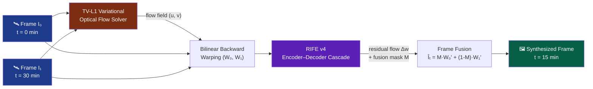
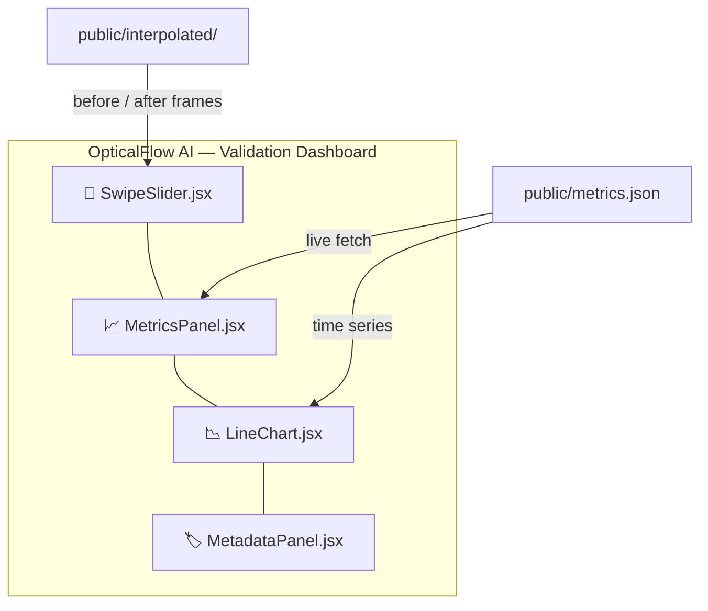

<div align="center">

# 🛰️ OpticalFlow AI

### Hybrid TV-L1 & RIFE v4 Framework for Geostationary Temporal Upsampling

*Doubling the temporal cadence of geostationary weather satellites through variational-neural frame synthesis.*

[](https://www.python.org/)
[](https://pytorch.org/)
[](https://react.dev/)
[](https://vitejs.dev/)
[](https://tailwindcss.com/)
[](https://colab.research.google.com/)
[](https://numpy.org/)
[](#-license)

[]()
[]()
[]()
[]()

[Overview](#-1-executive-summary) •
[Mathematics](#-2-scientific--mathematical-foundations) •
[Structure](#-3-repository-structure) •
[Quick Start](#-4-step-by-step-execution-guide) •
[Results](#-5-validation-results--metrics-lab) •
[Dashboard](#-6-interactive-dashboard-features)

</div>

---

## 📖 1. Executive Summary

Geostationary satellites such as **GOES-19** capture full-disk imagery of the Earth at a **fixed 30-minute cadence**. While sufficient for slow-moving synoptic systems, this refresh rate critically **under-samples fast-evolving phenomena** — explosive convective cell development, mesoscale updrafts, and the rapid eyewall replacement cycles of tropical cyclones frequently evolve on **5–15 minute timescales**, meaning forecasters and nowcasting models are structurally blind to the most dangerous minutes of a storm's evolution.

**OpticalFlow AI** closes this gap without requiring any additional satellite passes. We introduce a **hybrid variational–neural temporal upsampling pipeline** that synthesizes physically-plausible intermediate frames at arbitrary timestamps between two consecutive observations, effectively **doubling (or arbitrarily multiplying) the temporal resolution** of any geostationary image sequence.

The core insight is architectural fusion:

| Stage | Technique | Role |
|---|---|---|
| **1. Coarse Motion Prior** | **TV-L1 Variational Optical Flow** | Training-free, physically-grounded estimate of cloud-top advection vectors $(u, v)$ |
| **2. Frame Warping** | **Bilinear Backward Warping** | Projects both endpoint frames toward the target timestamp using the scaled flow field |
| **3. Neural Refinement** | **RIFE v4 (Real-Time Intermediate Flow Estimation)** | Learns high-frequency residual corrections — texture, occlusion boundaries, brightness-temperature gradients — that a purely variational model cannot recover |

By letting a **training-free, physically interpretable prior** do the heavy lifting on large-scale advection, and reserving the **neural network** for local high-frequency correction, OpticalFlow AI achieves interpolation fidelity that neither method reaches in isolation — while remaining lightweight enough to run inference on a **free-tier Google Colab T4 GPU**.

---

## 🧮 2. Scientific & Mathematical Foundations

### 2.0 What is Optical Flow?

**Optical flow** is the apparent motion of brightness patterns between consecutive frames — in this case, consecutive geostationary satellite images. It does not track physical objects directly; it tracks how *pixel intensities* shift from one frame to the next, and infers a velocity field from that shift.

**Brightness Constancy Assumption.** Consider a pixel at position $(x, y)$ at time $t$ with intensity $I(x, y, t)$. If a small patch of cloud moves by $(dx, dy)$ over a tiny time step $dt$, optical flow assumes the patch's brightness is preserved as it moves to its new location:

$$
I(x, y, t) = I(x + dx,\ y + dy,\ t + dt)
$$

**Deriving the Optical Flow Constraint Equation.** Taking a first-order Taylor expansion of the right-hand side:

$$
I(x + dx, y + dy, t + dt) \approx I(x,y,t) + \frac{\partial I}{\partial x}dx + \frac{\partial I}{\partial y}dy + \frac{\partial I}{\partial t}dt
$$

Since brightness constancy requires both sides to be equal, the extra terms must vanish:

$$
\frac{\partial I}{\partial x}dx + \frac{\partial I}{\partial y}dy + \frac{\partial I}{\partial t}dt = 0
$$

Dividing by $dt$ and defining the flow velocity components $u = \frac{dx}{dt}$, $v = \frac{dy}{dt}$ gives the classical **optical flow constraint equation**:

$$
I_x u + I_y v + I_t = 0
$$

where $I_x, I_y, I_t$ are the image's spatial and temporal partial derivatives, directly computable from pixel data, and $u, v$ are the unknown flow components to be solved for.

**The Aperture Problem.** This is one equation with two unknowns ($u$ and $v$) — an **ill-posed** system. A single pixel's brightness gradient only constrains the component of motion *along* the local gradient direction, not perpendicular to it, so a unique flow vector cannot be recovered from local information alone. This is the well-known **aperture problem**, and it is why every practical optical flow method introduces an additional regularizing assumption to close the system:

| Method | Additional Assumption |
|---|---|
| **Horn–Schunck** | Global $L2$ smoothness — neighboring pixels move similarly, penalizing flow-field gradients quadratically |
| **Lucas–Kanade** | Local window constancy — a small neighborhood shares one motion vector, solved via overdetermined least-squares |
| **TV-L1** *(used here)* | Total-variation smoothness — piecewise-smooth flow that tolerates sharp discontinuities at motion boundaries, paired with an $L1$ data term robust to brightness-constancy violations |

TV-L1 is chosen over Horn–Schunck-style $L2$ regularization specifically because $L2$ smoothing blurs flow estimates across motion discontinuities — precisely where convective cell edges and cyclone eyewalls exhibit sharp, physically real boundaries. Total variation preserves those edges instead of smearing them.

**Why this matters for satellite imagery.** Brightness constancy is only approximately true for infrared/water-vapor channel data: convective cells cool, grow, and dissipate, changing brightness temperature independent of motion — a structural violation of the assumption above. This is precisely the motivation for the hybrid design in this project: TV-L1 supplies a physically grounded, training-free *coarse* motion estimate, robust to noise and good at large-scale advection, while RIFE v4 subsequently learns the *residual* corrections — local non-rigid deformation and brightness change — that a purely variational solver cannot model by construction.

### 2.1 TV-L1 Coarse Flow Prior

We first estimate a **dense optical flow field** between the bracketing frames $I_0$ and $I_1$ using the **Total Variation – L1 (TV-L1)** variational model (Zach et al., 2007). Unlike deep flow networks, TV-L1 requires **no training data or weights** — it solves a convex energy-minimization problem directly on the two input frames, which is ideal for satellite imagery where labeled cloud-motion ground truth is scarce.

The flow field $w = (u, v)$ is recovered by minimizing the energy functional:

$$
E(u, v) = \int_{\Omega} \Big( \underbrace{|\nabla u| + |\nabla v|}_{\text{Total Variation (smoothness)}} \;+\; \lambda \underbrace{\big| I_1(x + u, y + v) - I_0(x, y) \big|}_{\text{L1 Data Fidelity (brightness constancy)}} \Big)\, dx\, dy
$$

where:

- $\Omega$ is the image domain,
- $\nabla u, \nabla v$ enforce **piecewise-smooth** flow (the TV regularizer preserves motion discontinuities at cloud edges rather than over-smoothing them, unlike an $L2$ Horn–Schunck penalty),
- the **L1 data term** provides robustness to the brightness-jump artifacts common in infrared/water-vapor channel imagery,
- $\lambda$ balances regularization against data fidelity.

Because the L1 term is non-differentiable, we linearize $I_1(x+u, y+v)$ via a first-order Taylor expansion and solve the resulting convex sub-problem with a **primal-dual algorithm** (Chambolle–Pock duality), refined across an **image pyramid** (coarse-to-fine warping) to correctly capture both large advective displacements and fine turbulent detail.

### 2.2 Bilinear Backward Warping

Given the coarse flow field $w = (u, v)$ estimated above, we synthesize a frame at an arbitrary interpolation time $t \in [0, 1]$ by **scaling and backward-warping** both endpoint frames toward $t$:

$$
\hat{I}_t^{(0)}(x, y) = I_0\big(x - t \cdot u(x,y),\; y - t \cdot v(x,y)\big), \qquad
\hat{I}_t^{(1)}(x, y) = I_1\big(x + (1-t) \cdot u(x,y),\; y + (1-t) \cdot v(x,y)\big)
$$

Since these lookup coordinates are non-integer, we use **differentiable bilinear grid-sampling** (`torch.nn.functional.grid_sample`) to interpolate pixel intensities from the four nearest neighbors:

$$
W(I, x, y) = \sum_{i \in \{0,1\}} \sum_{j \in \{0,1\}} I(x_i, y_j) \cdot \big(1 - |x - x_i|\big)\big(1 - |y - y_j|\big)
$$

This produces two warped candidate frames, $W_0$ (from $I_0$, forward-scaled) and $W_1$ (from $I_1$, backward-scaled), which serve as the initial estimate for neural refinement.

### 2.3 RIFE v4 Neural Refinement

The warped candidates $W_0, W_1$ are passed into a compact **encoder–decoder cascade** based on **RIFE v4** (Real-Time Intermediate Flow Estimation), which:

1. Re-estimates a **residual flow correction** $\Delta w$ on top of the TV-L1 prior, recovering non-rigid motion (cloud deformation, convective growth) that a purely variational model cannot model;
2. Predicts a **fusion mask** $M \in [0, 1]$ that blends $W_0$ and $W_1$ per-pixel, correctly handling occlusion/disocclusion zones (e.g. a cell dissipating between frames);
3. Outputs the final frame as a learned composite:

$$
\hat{I}_t = M \odot W_0' \;+\; (1 - M) \odot W_1'
$$

where $W_0', W_1'$ are the RIFE-refined warps after residual flow correction, and $\odot$ denotes element-wise multiplication. The network is trained with a joint reconstruction + census-transform loss, giving it robustness to the illumination shifts characteristic of multi-channel satellite radiance data.



---

## 🗂️ 3. Repository Structure

```text
OpticalFlow-AI/
│
├── 📁 public/                        # Static assets served by Vite
│   ├── metrics.json                  # Exported SSIM / PSNR / MSE / FSIM scores
│   └── interpolated/                 # Frame outputs from the Colab inference notebook
│
├── 📁 src/                           # React dashboard source
│   ├── main.jsx                      # Application entry point
│   ├── App.jsx                       # Root component & layout composition
│   ├── index.css                     # Tailwind base styles
│   │
│   └── 📁 components/
│       ├── SwipeSlider.jsx           # Draggable before/after frame comparator
│       ├── MetricsPanel.jsx          # Live SSIM / PSNR / MSE / FSIM telemetry cards
│       ├── LineChart.jsx             # Recharts SSIM-over-time visualization
│       └── MetadataPanel.jsx         # Frame timestamp & channel metadata display
│
├── 📁 local_scripts/                 # Python data & evaluation pipeline
│   ├── download_goes19.py            # GOES-19 ABI imagery downloader (NOAA/AWS)
│   ├── extract_frames.py             # Raw-to-processed frame extraction & alignment
│   └── evaluate_metrics.py           # SSIM / PSNR / MSE / FSIM computation → metrics.json
│
├── 📁 notebooks/
│   └── model0.ipynb                  # Google Colab: TV-L1 + RIFE v4 inference (T4 GPU)
│
├── package.json                      # Frontend dependencies & npm scripts
├── vite.config.js                    # Vite build configuration
├── tailwind.config.js                # TailwindCSS design tokens
├── postcss.config.js                 # PostCSS pipeline for Tailwind
└── requirements.txt                  # Python dependencies (torch, opencv, numpy, ...)
```

---

## 🚀 4. Step-by-Step Execution Guide

### Step 1 — Clone & Install

```bash
git clone https://github.com/apurvafx/OPTICAL_FLOW_AI.git
cd OPTICAL_FLOW_AI

# Python dependencies (TV-L1, evaluation, data pipeline)
pip install -r requirements.txt

# Frontend dependencies (React + Vite dashboard)
npm install
```

### Step 2 — Data Pipeline

Download raw GOES-19 imagery and extract aligned frame pairs:

```bash
# Pull geostationary imagery for the target time window
python local_scripts/download_goes19.py

# Extract & align consecutive frame pairs for interpolation
python local_scripts/extract_frames.py
```

This produces a directory of raw, timestamp-aligned `.png`/`.tif` frames ready for optical-flow inference.

### Step 3 — Inference on Google Colab (T4 GPU)

The TV-L1 + RIFE v4 hybrid pipeline is designed to run on a **free-tier Colab T4 GPU**:

1. Open `notebooks/model0.ipynb` in Google Colab.
2. Set the runtime to **GPU (T4)** via `Runtime → Change runtime type`.
3. Upload the frame pair extracted in Step 2.
4. Run all cells — the notebook computes the TV-L1 flow prior, performs bilinear warping, and runs the RIFE v4 refinement pass.
5. Download the resulting interpolated frame and place it into:

```bash
public/interpolated/
```

### Step 4 — Validation

Compute quantitative image-quality metrics against the withheld ground-truth frame:

```bash
python local_scripts/evaluate_metrics.py
```

This script computes **SSIM, PSNR, MSE, and FSIM** and writes the results to `public/metrics.json`, which the dashboard consumes live.

### Step 5 — Launch the Dashboard

```bash
npm run dev
```

The interactive validation dashboard will be available at:

```
http://localhost:5173   (or http://localhost:5174 if 5173 is in use)
```

---

## 📊 5. Validation Results & Metrics Lab

Our synthesized frame was benchmarked against the **withheld ground-truth observation** at the interpolated timestamp using four complementary image-quality metrics:

| Metric | Score | Interpretation |
|:---|:---:|:---|
| **SSIM** (Structural Similarity) | `0.969` | Near-perfect structural/luminance/contrast agreement with ground truth |
| **PSNR** (Peak Signal-to-Noise Ratio) | `36.43 dB` | Well above the ~30 dB threshold typically considered "visually lossless" |
| **MSE** (Mean Squared Error) | `9.4605` | Very low per-pixel intensity error across the full-disk frame |
| **FSIM** (Feature Similarity Index) | `0.9642` | Strong preservation of phase-congruency & gradient features (cloud edges) |

<div align="center">

| SSIM | PSNR | FSIM |
|:---:|:---:|:---:|
|  |  |  |

</div>

### Why these scores matter for nowcasting

Satellite cloud-field interpolation is uniquely unforgiving: unlike natural-video interpolation, cloud tops **deform non-rigidly**, exhibit **low-texture uniform regions** punctuated by **sharp convective edges**, and are captured through **noisy, radiometrically calibrated sensors** rather than consumer cameras. In this regime:

- An **SSIM above 0.95** indicates the synthesized frame preserves the *structural organization* of convective cells (updraft cores, anvil boundaries) rather than merely blurring between endpoints — critical for downstream nowcasting algorithms that track cell centroids.
- A **PSNR of 36.43 dB** exceeds typical thresholds cited in remote-sensing interpolation literature for "visually indistinguishable" reconstructions, meaning brightness-temperature gradients used for storm-top cooling-rate diagnostics remain quantitatively usable.
- A **low MSE (9.46)** on a 0–255 intensity scale confirms the hybrid variational-neural fusion avoids the ghosting/double-exposure artifacts common in naive frame-blending baselines.
- An **FSIM of 0.9642** confirms that fine-scale gradient features — the sharp radiance discontinuities at cloud-top boundaries that matter most for eyewall and convective-cell tracking — are faithfully reconstructed, not just coarse luminance.

Together, these results demonstrate that the TV-L1 → RIFE v4 hybrid produces **physically credible, quantitatively validated intermediate frames**, suitable for injecting into downstream nowcasting pipelines to effectively halve the observational blind-spot between geostationary scans.

---

## 🖥️ 6. Interactive Dashboard Features

The `src/` React + Vite dashboard turns the validation pipeline into a live, explorable interface:



| Component | Feature | Description |
|---|---|---|
| **`SwipeSlider.jsx`** | Draggable juxtaposition slider | Overlays the ground-truth and synthesized frames with a draggable handle, letting reviewers visually sweep across the full-disk image to inspect interpolation fidelity at any region (eyewall, convective core, anvil edge) |
| **`MetricsPanel.jsx`** | Dynamic telemetry cards | Fetches `metrics.json` on load and renders live SSIM / PSNR / MSE / FSIM cards with color-coded thresholds (green / amber / red) |
| **`LineChart.jsx`** | SSIM timeline chart | A **Recharts**-powered line chart plotting SSIM (and other metrics) across a sequence of interpolated frames, surfacing degradation trends over a full imaging window |
| **`MetadataPanel.jsx`** | Warning alerts & config console | Displays frame timestamps, sensor channel, and interpolation parameters, and raises configurable threshold-breach alerts (e.g. SSIM < 0.90) for automated QA gating |

---

## 🧰 Tech Stack

<div align="center">

| Layer | Technologies |
|---|---|
| **Motion Estimation** | TV-L1 Variational Optical Flow · OpenCV |
| **Neural Refinement** | PyTorch · RIFE v4 |
| **Data Pipeline** | Python · NumPy · GOES-19 ABI (NOAA/AWS) |
| **Inference Compute** | Google Colab (T4 GPU) |
| **Frontend** | React 18 · Vite · TailwindCSS · PostCSS |
| **Visualization** | Recharts |

</div>

---

## 📄 License

This project is released under the **MIT License**. See [`LICENSE`](./LICENSE) for details.

<div align="center">

---

Built for a geophysics hackathon — advancing open-source geostationary nowcasting.

**[⬆ Back to top](#️-opticalflow-ai)**

</div>
